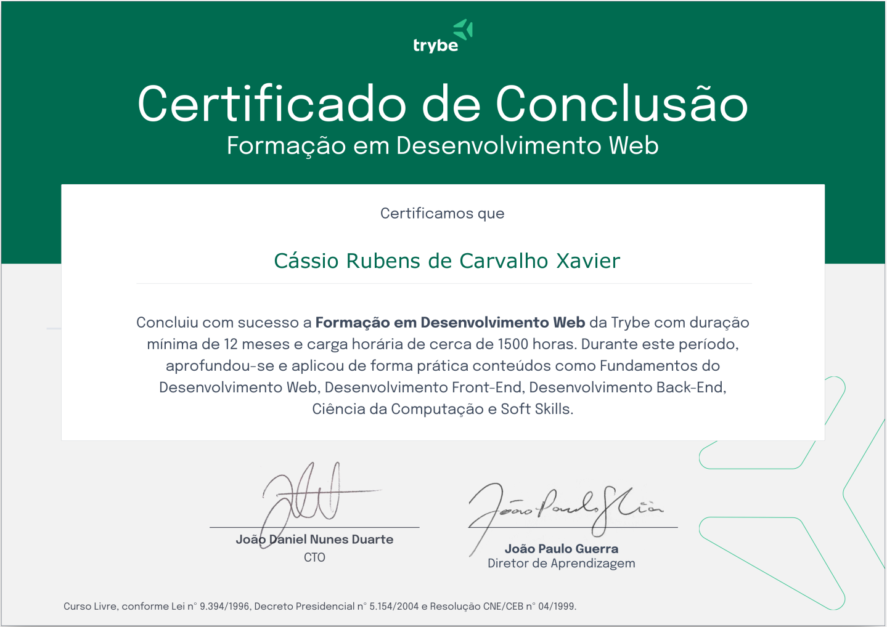

# Projetos desenvolvidos no curso de Formação em Desenvolvimento Web - [Trybe](https://www.betrybe.com/)

____

> ## Curso com duração mínima de `12 meses` e carga horária compreendida com cerca de `1.500 horas.`

____

> ### Durante este período, aprofundou-se e aplicou de forma prática conteúdos como `Fundamentos do Desenvolvimento Web`, `Desenvolvimento Front-End`, `Desenvolvimento Back-End`, `Ciência da Computação` e `Soft Skills.`

____

> ### `Importante:`

> ### Os projetos aqui desenvolvidos, foram de caráter `obrigatório` e `avaliativo` para conclusão de cada módulo. Esclarecemos ainda, que para `aprovação` *de cada projeto*, foi exigido o `cumprimento de no mínimo 80%(oitenta por cento) dos requisitos obrigatórios (regra de negócio)`, sendo tais requisitos descrito no **Readme** de cada projeto.

____

____

- ## Módulo 01

### Fundamentos do Desenvolvimento Web

#### Durante este período, aprofundou-se e aplicou de forma prática conteúdos como: `Unix` & `Bash`, `Git` & `Internet`, `JS`  & `DOM`, `HTML` & `CSS`, `ES6`, `Higher Order Functions` e `Testes Unitários.`

____

- ## Módulo 02

### Desenvolvimento Front-End

#### Durante este período, aprofundou-se e aplicou de forma prática conteúdos como: `React`, incluindo `Componentes`, `Estado` e `Eventos`, `Componentes Controlados`, `Ciclo de Vida`, `Router`, `Testes com RTL`, `Redux com React`, `Context API` e `React Hooks.`

____

- ## Módulo 03

### Desenvolvimento Back-End

#### Durante este período, aprofundou-se e aplicou de forma prática conteúdos como: `Banco de Dados SQL` e `NoSQL`, `Node` e `Express.js`, `MVC`, `API`, `REST`, `JWT` e `File Upload`, `SOLID`, `ORM`, `Sockets` e `deploy` com `Heroku.`

____

- ## Módulo 04

### Ciência da Computação

#### Durante este período, aprofundou-se e aplicou de forma prática conteúdos como: `Pyton` e `OOP`, `Algoritmos` e `Complexidade`, `Estrutura de Dados` e `Resolução de Problemas.`

____

### Autor

### :black_nib: Cássio Rubens 🚀

- [Portfólio](https://cassiorubens-cr.github.io/portfolio/)
- [GitHub](https://github.com/CassioRubens-CR)
- [Linkedin](https://www.linkedin.com/in/cássio-rubens)
